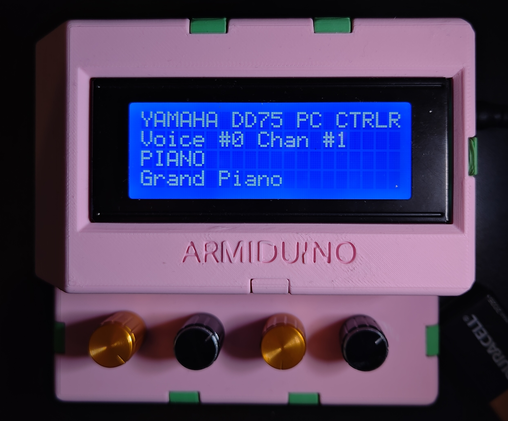

# **AR*MID*U*I*NO**

An Arduino based MIDI0 PC1 controller stylized as **AR*MID*U*I*NO**.

## Description

The **AR*MID*U*I*NO** is a combination software and hardware project. Technically no sofware skills are required, but a rudimentary comprehension of Arduino programming is recommended. If everything works first try, then there is no need to touch the software; however, there may be differences in our hardware that require alterations to the code. A beginner-level understanding of circuitry is required because this project is self-assembled.

This project aims to provide a solution (or starting point) for any MIDI hobbyists that would like to build their own simple MIDI PC controller that can specify the MSB2 bank value, the LSB3 bank value, the PC number, as well as the MIDI channel.

This project was inspired by the fact that I was not able to find a simple standalone MIDI PC controller that was both relatively affordable and clear on how to send PC messages to a system that involved banks reliant on both a MSB and LSB value. There are plenty of commercially available MIDI controllers and pedals out there that can do what this device can do and so much more, but they didn't seem very intuitive to someone like me who was relatively inexperienced with MIDI (before I started this project) and were simply overkill for what I needed to do. Hopefully this project helps others who are in the same boat. 

I have provided two separate software implementations that rely on the exact same hardware: one generic and one device-specific (although this one can be tailored for your own use-cases); more on these further below.

### Brief explanation of Banks and MIDI PC Messages

Here is an aside to explain how Banks and MIDI PC messages work on a more abstract level before I get into the implementation details of the software itself. MIDI is a software protocol that is useful for controlling musical instruments whether thats through a DAW4 or a Synthesizer. Its most common use-case is for sending musical note data across devices, but it can also send other messages for controlling specific parameters. The types of messages required for this project are MIDI CC5 messages and MIDI PC messages. Specifically one MIDI CC message is required to set the MSB bank value, another MIDI CC message is required to set the LSB bank value, and one MIDI PC message is required to specify the PC number. Here is a table to visualize what you need in order to successfully specify a program on a system that requires a MSB value, LSB value, as well as a PC number:

| Name      | MIDI message type | Control Number | Value | MIDI Channel | Comments                                                                 |
|-----------|-------------------|----------------|-------|--------------|--------------------------------------------------------------------------|
| MSB Value | CC                | 0x00           | 0-127 | 1-16         | These control numbers are standard, refer to the MIDI spec for more info |
| LSB Value | CC                | 0x20           | 0-127 | 1-16         | 0x20 is hexadecimal for 32                                               |
| PC Number | PC                | N/A            | 1-128 | 1-16         | PC is seperate from CC and therefore has no control number               |

*The order in which these are sent do not matter*

### MIDI Program Controller (Generic Implementation)

The generic implementation is meant to work with any MIDI capable device that uses PC messages. It can serve as a complete piece of software for anyone to use or simply as a template for others to work off of in order to develop a more specific version for their usecase.

 \
*Encoders are indexed 0 to 3 going left to right*

The control scheme for this implementation is as follows:

- *Encoder0*:
  - **Rotating**: Increment/Decrement the MSB value.
  - **Pressing**: Reset the MSB value to 0.
- *Encoder1*:
  - **Rotating**: Increment/Decrement the LSB value.
  - **Pressing**: Reset the LSB value to 0.
- *Encoder2*:
  - **Rotating**: Increment/Decrement the PC number.
  - **Pressing**: Reset the PC number to 1.
- *Encoder3*:
  - **Rotating**: Increment/Decrement the MIDI channel number.
  - **Pressing**: Send the designated MSB, LSB, and PC to the specified MIDI channel.

### MIDI Program Controller for the YAMAHA DD75 (Device-Specific Implementation)

The device-specific implementation is a streamlined approach to sending PC messages for the YAMAHA DD75 e-drum kit. This device is an e-drum kit on the surface that also includes a hidden YAMAHA sample instrument library. This library can only be accessed by an external MIDI controller, hence the development of this project. Based on the MIDI reference guide linked below, I've mapped each instrument and their corresponding MIDI PC value to a library which I can scroll through easily using the **AR*MID*U*I*NO**. This removes the need to memorize which instruments correspond to which PC values.

[Yamaha DD-75 MIDI Reference guide](https://usa.yamaha.com/files/download/other_assets/3/892623/dd75_en_mr_a0_web.pdf)

 \
*Encoders are indexed 0 to 3 going left to right*

The control scheme for this implementation is as follows:

- *Encoder0*:
  - **Rotating**: Increment/Decrement the Voice6 category; the item in the 3rd row.
  - **Pressing and Holding**: Disables the complete readout of each Voice name; some exceed the 20 character limit and will scroll across the screen unless *Encoder0* is held down. This is used in combination with rotating one of the encoders while scrolling through Voices.
- *Encoder1*:
  - **Rotating**: Increment/Decrement the Voice number by a value of 100.
  - **Pressing**: Reset the Voice number's hundreds place value to 0.
- *Encoder2*:
  - **Rotating**: Increment/Decrement the Voice number by a value of 1.
  - **Pressing**: Reset the Voice number to 0.
- *Encoder3*:
  - **Rotating**: Increment/Decrement the MIDI channel number.
  - **Pressing**: Send the designated MSB, LSB, and PC to the specified MIDI channel.2

## Required Parts

- 1x [Arduino Mega](https://store-usa.arduino.cc/products/arduino-mega-2560-rev3?selectedStore=us) (revision agnostic)
- 2x 220 ohm resistors
- 4x 5-pin rotary encoders
- 1x 5-pin MIDI socket ([These are the ones I used](https://www.amazon.com/gp/product/B01GBT9RC0?psc=1); leaving a link because the 3D-printable enclosure is modeled with this specific MIDI jack in mind)
- 1x 20x4 LCD display (model# 2004A) with a 4 pin input backpack
- Wires

## Optional Parts

- [3D modeled enclosure](https://www.thingiverse.com/thing:6542581)
- 8x 15mm M3 standoffs (male to female)
- 4x 10mm M3 standoffs (female to female)
- 4x M3 nuts
- 12x 5.5mm M3 screws
- 1x protoboard

## Assembly Instructions

[Link to guide](Assembly_Instructions.md)

## Future Plans

- Add a speed-dial feature to the generic implementation so that users can save and quickly access specific PC and CC value combinations.
- Feel free to submit any feature request or improvements.

## Known bugs

- Rotating the encoders too quickly in one direction will generate a signal that corresponds with a rotation in the opposite direction meaning the desired outcome may be reversed (e.g. incrementing a value to quickly may actually decrement it instead). This may be due to the lack of debouncing for the rotatry encoder output.
- Feel free to report an Issue or make a Pull Request if you run into additional problems

## Appendix
0*Musical Instrument Digital Interface* \
1*Program Change* \
2*Most Significant Bit* \
3*Least Significant Bit* \
4*Digital Audio Workstation* \
5[*Control Change*](https://www.midi.org/specifications-old/item/table-3-control-change-messages-data-bytes-2) \
6*Probably confusing for some, myself included, but the MIDI Reference that Yamaha provides for the DD75 refers to each program/instrument as a "Voice"; therefore, I do as well. Usage here should not be confused for note polyphony as is the use case of the term "Voice" when applied (most often) to synthesizers.*

## Version Log

### V1.0.0
Official Release of Software and Guide

*If you have any questions feel free to submit an issue.*